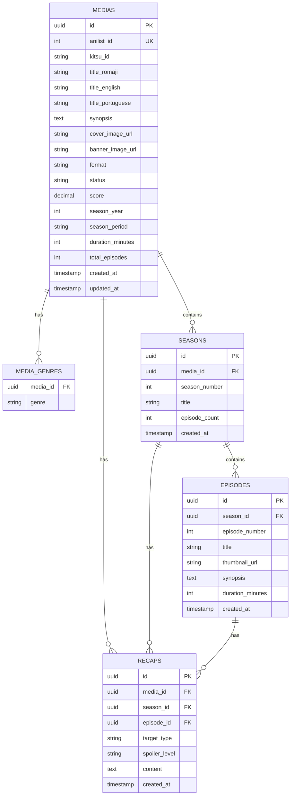

# PRD — RecapMe Backend (Catálogo Relacional Local & Ingestão Sob Demanda)

> **Projeto:** RecapMe — Backend REST API, Catálogo Local & Orquestração de IA  
> **Versão:** V1.0 (Refatoração Arquitetural do Zero)  
> **Data:** 28/08/2026  
> **Stack Principal:** Java 21 + Spring Boot 3.3+ + Spring AI + Spring Data JPA + PostgreSQL (Neon) + Flyway + RestClient / GraphQL Client  
> **Conformidade:** Richardson Nível 2 + RFC 7807 (`ProblemDetail`) + JPA Conventions + OpenAPI 3.0 (SpringDoc)  
> **Status:** Aprovado para Especificação & Desenvolvimento  

---

## 1. Histórico de Revisão

| Versão | Data | Autor | Descrição |
| :--- | :--- | :--- | :--- |
| V0.1 | 27/08/2026 | Arquitetura Legada | Especificação inicial baseada em proxy em tempo real para TMDb/Jikan (*Deprecada*). |
| V1.0 | 28/08/2026 | Engenharia & Produto | **Refatoração Completa do Backend**: Transição para Catálogo Local Próprio em PostgreSQL com *Lazy Ingestion* (AniList + Kitsu GraphQL), busca Full-Text com `unaccent`, hierarquia relacional completa e desacoplamento do cliente. |
| V1.1 | 01/09/2026 | Engenharia & Produto | **Seções da Home & Ingestão Reativa**: Adicionados endpoints agregados da Home (`/home`, `/trending`, `/popular`, `/top-rated`), query AniList GraphQL unificada com cache Caffeine, correção de resiliência no schema Kitsu GraphQL (`titles` escalares) e enriquecimento reativo sob demanda de episódios (`ensureEpisodesIngested`). |

---

## 2. Contexto e Decisão de Design Arquitetural

### 2.1 O Problema da Arquitetura Anterior (Proxy)
Na versão anterior, o backend operava como um simples intermediário (*proxy*) repassando requisições do frontend para APIs de terceiros em tempo real. Isso gerava severos gargalos:
1. **Lentidão e Alta Latência:** Cada busca ou carregamento de página dependia do tempo de resposta e instabilidade de serviços externos.
2. **Fragilidade e Rate Limits:** Riscos constantes de bloqueio por limites de taxa (*rate limits*) nas APIs públicas.
3. **Falta de Soberania de Dados:** Impossibilidade de realizar buscas textuais avançadas, filtros compostos, ordenações personalizadas e relacionamentos relacionais nativos com os Resumos (*Recaps*) e Chats de IA.

### 2.2 A Nova Solução: Catálogo Local Próprio com Ingestão Sob Demanda (*Lazy Ingestion*)
O cliente (frontend) **nunca** se comunica diretamente com APIs externas e o backend **não** atua como proxy síncrono descartável.
- O backend possui sua própria base de dados relacional em **PostgreSQL**.
- Toda consulta, listagem, filtro e busca textual é executada **diretamente no nosso banco de dados**.
- **Ingestão Sob Demanda (*Lazy Ingestion*) baseada na engenharia do AnimeFlix:**
  - Quando um usuário busca ou acessa uma obra que ainda não reside no banco local, o backend consulta os provedores externos de forma orquestrada:
    - **AniList GraphQL API (`https://graphql.anilist.co`):** Obtém metadados consolidados (títulos, sinopse, cover/banner em alta definição, status, pontuações, gêneros, formato).
    - **Kitsu GraphQL API (`https://kitsu.io/api/graphql`):** Obtém a árvore hierárquica detalhada de episódios (números, títulos canônicos e thumbnails).
  - O backend normaliza esses dados, persiste a hierarquia completa de forma atômica no PostgreSQL e retorna a entidade local.
  - A partir desse momento, todas as requisições subsequentes para aquela obra são atendidas **100% pelo PostgreSQL local** com latência mínima (< 30ms).

```
   ┌────────────────────────────────────────────────────────┐
   │                  Cliente (Frontend)                    │
   └───────────────────────────┬────────────────────────────┘
                               │  1. Requisições REST (/api/v1/medias/...)
                               ▼
   ┌────────────────────────────────────────────────────────┐
   │                  RecapMe Backend (API)                 │
   └─────────────┬───────────────────────────▲──────────────┘
                 │ 2. Consulta Local         │ 4. Persistência
                 ▼                           │    Hierárquica
   ┌───────────────────────────┐             │
   │  PostgreSQL (Neon / Local)│             │
   └───────────────────────────┘             │
                 │ (Se não encontrado)       │
                 ▼                           │
   ┌─────────────────────────────────────────┴──────────────┐
   │         Módulo de Ingestão Sob Demanda                 │
   │   ┌───────────────────────┬────────────────────────┐   │
   │   │  AniList GraphQL      │  Kitsu GraphQL         │   │
   │   │  (Metadados & Imagens)│  (Árvore de Episódios) │   │
   │   └───────────────────────┴────────────────────────┘   │
   └────────────────────────────────────────────────────────┘
```

---

## 3. Padrões Técnicos e Stack do Backend

### 3.1 Stack Tecnológica
- **Linguagem & Runtime:** Java 21 (LTS).
- **Framework:** Spring Boot 3.3+.
- **Persistência:** Spring Data JPA + Hibernate + PostgreSQL Driver.
- **Banco de Dados:** PostgreSQL 16+ (hospedado na Neon ou local) com extensões `unaccent` e `pgcrypto`.
- **Evolução de Banco:** Flyway Migration.
- **IA e LLM:** Spring AI (OpenAI / Ollama / Neon AI Gateway).
- **Cliente HTTP / GraphQL:** Spring `RestClient` / Spring GraphQL Client com suporte a resiliência e timeout.
- **Documentação da API:** SpringDoc OpenAPI 3 / Swagger UI (`/swagger-ui.html`).

### 3.2 Conformidade e Padrões de Projeto
1. **Richardson Nível 2:**
   - URIs com substantivos no plural (`/api/v1/medias`, `/api/v1/seasons`, `/api/v1/episodes`, `/api/v1/recaps`, `/api/v1/chats`).
   - Verbos HTTP semânticos: `GET` (busca/leitura), `POST` (criação/ações de geração), `PUT`/`PATCH` (atualização), `DELETE` (remoção).
   - Sem verbos na URI (ex: utilizar `POST /api/v1/recaps` em vez de `/api/v1/recaps/createRecap`).
   - Base URI definida exclusivamente na anotação de classe `@RequestMapping("/api/v1/...")`.
2. **DTOs Estritos e Validação:**
   - Requisições: `<Name>RequestDto` anotados com Bean Validation (`@NotBlank`, `@NotNull`, `@Min`, `@Valid`).
   - Respostas: `<Action><Name>ResponseDto` com anotações `@Schema` do OpenAPI em todos os atributos e classes.
   - Controladores sempre retornam `ResponseEntity<T>` com status HTTP explícito.
3. **Tratamento Global de Erros (RFC 7807 / ProblemDetail):**
   - Nenhum bloco `try/catch` em métodos de Controladores.
   - Centralização total via `@RestControllerAdvice` estendendo `ResponseEntityExceptionHandler`.
   - Formato padronizado de erro HTTP `application/problem+json`.
4. **Convenções de Entidades JPA:**
   - Classes singulares (`Media`, `Season`, `Episode`, `Recap`).
   - Tabelas plurais via `@Table(name = "medias")`, `@Table(name = "seasons")`, etc.
   - Chaves Primárias: `UUID` (`@GeneratedValue(strategy = GenerationType.AUTO)`).
   - Todo campo mapeado com `@Column(name = "...", nullable = ..., length = ...)`.
   - Implementação obrigatória de `java.io.Serializable`.

---

## 4. Modelo de Dados Relacional (Hierarquia Completa)

O banco de dados armazena a árvore completa da obra para permitir navegação estruturada, síntese granular de resumos por episódio/temporada e injeção contextual no chat de IA.



### 4.1 Entidades e Estrutura de Tabelas

#### Tabela `medias` (Entidade `Media`)
- `id` (UUID, PK)
- `anilist_id` (INTEGER, UNIQUE, Nullable - ID da obra no AniList)
- `kitsu_id` (VARCHAR(50), Nullable - ID da obra no Kitsu)
- `title_romaji` (VARCHAR(255), NOT NULL - Título em Romaji)
- `title_english` (VARCHAR(255), Nullable - Título em Inglês)
- `title_portuguese` (VARCHAR(255), Nullable - Título em Português se disponível)
- `synopsis` (TEXT, Nullable - Sinopse da obra)
- `cover_image_url` (VARCHAR(500), Nullable - Imagem de capa em alta definição)
- `banner_image_url` (VARCHAR(500), Nullable - Banner panorâmico)
- `format` (VARCHAR(30), NOT NULL - `TV`, `TV_SHORT`, `MOVIE`, `SPECIAL`, `OVA`, `ONA`)
- `status` (VARCHAR(30), NOT NULL - `FINISHED`, `RELEASING`, `NOT_YET_RELEASED`, `CANCELLED`, `HIATUS`)
- `score` (NUMERIC(4, 2), Nullable - Nota média avaliada, ex: 8.45)
- `season_year` (INTEGER, Nullable - Ano de lançamento, ex: 2024)
- `season_period` (VARCHAR(20), Nullable - `WINTER`, `SPRING`, `SUMMER`, `FALL`)
- `duration_minutes` (INTEGER, Nullable - Duração média do episódio/filme)
- `total_episodes` (INTEGER, NOT NULL DEFAULT 0 - Contagem de episódios)
- `created_at` (TIMESTAMP WITH TIME ZONE, NOT NULL)
- `updated_at` (TIMESTAMP WITH TIME ZONE, NOT NULL)

#### Tabela `media_genres` (Coleção de Gêneros)
- `media_id` (UUID, PK, FK `medias.id` ON DELETE CASCADE)
- `genre` (VARCHAR(50), PK - ex: `Action`, `Fantasy`, `Sci-Fi`, `Drama`)

#### Tabela `seasons` (Entidade `Season`)
- `id` (UUID, PK)
- `media_id` (UUID, NOT NULL, FK `medias.id` ON DELETE CASCADE)
- `season_number` (INTEGER, NOT NULL DEFAULT 1)
- `title` (VARCHAR(255), NOT NULL - ex: "Temporada 1", "Arco do Distrito do Entretenimento")
- `episode_count` (INTEGER, NOT NULL DEFAULT 0)
- `created_at` (TIMESTAMP WITH TIME ZONE, NOT NULL)
- *Constraint Única:* `UNIQUE(media_id, season_number)`

#### Tabela `episodes` (Entidade `Episode`)
- `id` (UUID, PK)
- `season_id` (UUID, NOT NULL, FK `seasons.id` ON DELETE CASCADE)
- `episode_number` (INTEGER, NOT NULL)
- `title` (VARCHAR(255), NOT NULL - Título do episódio ou fallback "Episódio X")
- `thumbnail_url` (VARCHAR(500), Nullable - Thumbnail oficial do episódio obtido via Kitsu)
- `synopsis` (TEXT, Nullable - Descrição específica do episódio se disponível)
- `duration_minutes` (INTEGER, Nullable)
- `created_at` (TIMESTAMP WITH TIME ZONE, NOT NULL)
- *Constraint Única:* `UNIQUE(season_id, episode_number)`

#### Tabela `recaps` (Entidade `Recap`)
- `id` (UUID, PK)
- `media_id` (UUID, NOT NULL, FK `medias.id` ON DELETE CASCADE)
- `season_id` (UUID, Nullable, FK `seasons.id` ON DELETE CASCADE)
- `episode_id` (UUID, Nullable, FK `episodes.id` ON DELETE CASCADE)
- `target_type` (VARCHAR(30), NOT NULL - `MEDIA`, `SEASON`, `EPISODE`)
- `spoiler_level` (VARCHAR(50), NOT NULL - Identificador do limite de spoilers, ex: `S1E12`, `FULL_MEDIA`)
- `content` (TEXT, NOT NULL - Texto do resumo gerado por IA com formatação rica Markdown)
- `created_at` (TIMESTAMP WITH TIME ZONE, NOT NULL)

---

## 5. Módulo de Ingestão Sob Demanda (AniList + Kitsu Adapter)

O serviço de ingestão (`MediaIngestionService`) é o responsável por traduzir e harmonizar os contratos externos das APIs GraphQL de AniList e Kitsu para o modelo relacional local.

### 5.1 AniList GraphQL Client
- **Endpoint:** `https://graphql.anilist.co`
- **Queries Executadas:**
  1. `getAnimeInfo(id: $id)` / `searchAnime(keyword: $keyword)`:
     - Extrai: `id`, `title { english, romaji }`, `coverImage { large, extraLarge, color }`, `bannerImage`, `format`, `duration`, `meanScore`, `status`, `genres`, `seasonYear`, `season`, `description`.
  2. `getPopularBanner(seasonYear: $year)` / `indexPage`:
     - Utilizado para descoberta e ingestão de títulos populares e em alta.

### 5.2 Kitsu GraphQL Client
- **Endpoint:** `https://kitsu.io/api/graphql`
- **Queries Executadas:**
  1. `getAnimesKitsu(title: $title, first: 5)`:
     - Executa busca pelo título e filtra nós com matching estrito de ano (`startDate`) e temporada (`season`).
  2. `getEpisodeKitsu(id: $id, first: 100)`:
     - Extrai a lista de episódios contendo: `number`, `titles { romanized original translated }`, `thumbnail { original { url } }`, `length`.
     - *Resiliência de Schema:* Como o Kitsu define `titles.canonical` como `NON_NULL` mas o banco deles contém `null` para várias obras (ex.: *Mushoku Tensei*), são consultados os campos escalares seguros `romanized`, `original` e `translated`, com fallback para `"Episódio X"` quando ausentes.

### 5.3 Algoritmo de Matching, Normalização e Ingestão Sob Demanda
1. O backend busca as informações da obra no **AniList**.
2. Com o título e ano retornados pelo AniList, o backend consulta o **Kitsu** em `https://kitsu.io/api/graphql` com header `User-Agent: RecapMe/1.0` (evitando bloqueios Cloudflare 403).
3. O algoritmo de cruzamento seleciona o anime correspondente no Kitsu conferindo:
   $$\text{Kitsu.startDate.split('-')[0]} == \text{AniList.seasonYear}$$
4. O backend constrói o objeto `Media`, instancia a `Season` (Temporada 1 por padrão ou agrupamentos sazonais) e mapeia cada nó de episódio retornado pelo Kitsu para entidades `Episode`.
5. Se a obra for salva inicialmente como resumo (ex: carregada pelas seções da Home) ou o Kitsu estiver temporariamente indisponível, o método `ensureEpisodesIngested(Media)` é invocado de forma reativa sob demanda na primeira tentativa de leitura de detalhes (`/medias/{id}`, `/medias/{id}/seasons` ou `searchAndIngest`), garantindo que a árvore de episódios seja populada e enriquecida no PostgreSQL.
6. A transação inteira é salva no PostgreSQL dentro de um bloco `@Transactional`.

### 5.4 Tratamento de Concorrência e Idempotência
Para evitar condições de corrida (*race conditions*) quando múltiplos clientes buscam a mesma obra simultaneamente:
- A coluna `anilist_id` possui índice único no banco de dados (`UNIQUE`).
- A rotina de ingestão utiliza verificação antes de inserir (*Check-then-Act*) combinada com tratamento de `DataIntegrityViolationException` (retornando a entidade recém-criada pela thread concorrente).
- O enriquecimento de episódios verifica `episodeRepository.countBySeasonMediaId(mediaId)` antes de acionar o Kitsu, garantindo execução estritamente idempotente.

### 5.5 Referência Concreta de Código & Diretrizes de Consulta do AnimeFlix

> ⚠️ **DIRETRIZ OBRIGATÓRIA PARA AGENTES DE IA E DESENVOLVEDORES:**  
> Ao implementar ou refatorar qualquer classe dos pacotes `client`, `service/ingestion` ou `dto/external`, **não deduza ou imagine payloads e comportamentos**. O agente/desenvolvedor **DEVE** consultar diretamente o código-fonte concreto do repositório de referência no GitHub (`chirag-droid/animeflix` ou fork correspondente) utilizando as ferramentas de MCP do GitHub (`get_file_contents`).

#### Mapa de Arquivos de Referência no Repositório AnimeFlix:

| Módulo / Funcionalidade | Arquivo de Origem no Repositório | O que o Agente DEVE Inspecionar e Copiar |
| :--- | :--- | :--- |
| **Algoritmo de Matching e Filtro** | `packages/api/src/api.ts` (linhas 51–87) | Função `getKitsuEpisodes`: filtragem exata por `startDate` (ano), `season` e contagem de episódios. |
| **Estratégia de Busca em Paralelo** | `frontend/pages/anime/[id].tsx` (linhas 47–56) | Chamada simultânea `Promise.all` para `title.english` e `title.romaji`, priorizando o que trouxer episódios (`episodeCount > 0`). |
| **Queries GraphQL de Metadados (AniList)** | `packages/api/src/graphql/aniList/anime.gql` e `pages.gql` | Queries `getAnimeInfo`, `searchAnime`, `getPopularBanner`, `indexPage` e fragments `AnimeInfo`, `AnimeBanner`. |
| **Fragments de Metadados (AniList)** | `packages/api/src/graphql/aniList/fragments/AnimeInfo.gql` e `AnimeBanner.gql` | Campos exatos: `coverImage { large, medium, color }`, `bannerImage`, `format`, `duration`, `meanScore`, `status`. |
| **Queries GraphQL de Episódios (Kitsu)** | `packages/api/src/graphql/kitsu/anime.gql` | Query `getAnimesKitsu(title: $title, first: 5)` e `getEpisodeKitsu(id: $id)`. |
| **Fragments de Episódios (Kitsu)** | `packages/api/src/graphql/kitsu/fragments/EpisodeInfo.gql` | Campos de episódio: `number`, `titles { canonical }`, `thumbnail { original { url } }`. |
| **Endpoints Oficiais de Produção** | `packages/api/src/constants.ts` | URLs GraphQL: `https://graphql.anilist.co` e `https://kitsu.io/api/graphql`. |

#### Exemplo Concreto do Código de Origem a ser Traduzido para Java:
```typescript
// packages/api/src/api.ts (AnimeFlix)
export const getKitsuEpisodes = async (title, season, startDate) => {
  const kitsuAnimes = await getAnimesKitsu({ title, first: 8 });
  return kitsuAnimes.searchAnimeByTitle.animes.filter((r) => {
    if (!r || !r.startDate) return false;
    if (r.season !== season && season) return false;
    return r.startDate.trim().split('-')[0] === startDate.toString();
  })[0];
};
```

---

## 6. Módulo de Busca Full-Text no PostgreSQL (Com `unaccent`)

Para atender ao requisito de busca rápida diretamente na base local tolerando apenas **falta de acentuação**:

### 6.1 Extensão `unaccent` e Configuração de Busca
No script Flyway de criação do schema:
```sql
CREATE EXTENSION IF NOT EXISTS unaccent;
CREATE EXTENSION IF NOT EXISTS pgcrypto;

-- Função wrapper IMMUTABLE para permitir uso do unaccent em índices do PostgreSQL
CREATE OR REPLACE FUNCTION immutable_unaccent(text)
  RETURNS text AS
$func$
  SELECT public.unaccent('public.unaccent', $1)
$func$ LANGUAGE sql IMMUTABLE PARALLEL SAFE STRICT;

-- Índice para busca textual tolerante a acentuação e case-insensitive nos títulos
CREATE INDEX idx_medias_title_unaccent ON medias USING gin(
    to_tsvector('simple', immutable_unaccent(coalesce(title_romaji, '') || ' ' || coalesce(title_english, '') || ' ' || coalesce(title_portuguese, '')))
);
```

### 6.2 Estratégia de Consulta
As queries derivadas e nativas no repositório `MediaRepository` utilizam a função `immutable_unaccent`:
```sql
SELECT m.* FROM medias m
WHERE to_tsvector('simple', immutable_unaccent(coalesce(m.title_romaji, '') || ' ' || coalesce(m.title_english, '') || ' ' || coalesce(m.title_portuguese, '')))
      @@ plainto_tsquery('simple', immutable_unaccent(:searchTerm))
   OR immutable_unaccent(lower(m.title_romaji)) LIKE immutable_unaccent(lower(concat('%', :searchTerm, '%')))
   OR immutable_unaccent(lower(coalesce(m.title_english, ''))) LIKE immutable_unaccent(lower(concat('%', :searchTerm, '%')))
   OR immutable_unaccent(lower(coalesce(m.title_portuguese, ''))) LIKE immutable_unaccent(lower(concat('%', :searchTerm, '%')))
ORDER BY m.score DESC NULLS LAST;
```

---

## 7. Especificação dos Endpoints RESTful (Richardson Nível 2)

Todos os endpoints operam sob o prefixo `/api/v1`.

### 7.1 Módulo de Obras (`/api/v1/medias`)

#### `GET /api/v1/medias/home`
- **Descrição:** Retorna as seções agregadas da Home Page em uma única requisição (Banner Hero, Trending Now / Em Alta, Popular e Top Rated All Time), com cache Caffeine em memória (`home-sections`) e fallback resiliente para o banco local.
- **Query Params:**
  - `perPage` (int, default: 10)
  - `seasonYear` (int, opcional - ano para filtro de banner, default: ano corrente)
- **Status Sucesso:** `200 OK`
- **Response DTO (`HomeSectionsResponseDto`):**
```json
{
  "banner": {
    "id": "7fa85f64-5717-4562-b3fc-2c963f66afa6",
    "anilistId": 16498,
    "titleRomaji": "Shingeki no Kyojin",
    "titleEnglish": "Attack on Titan",
    "score": 8.65,
    "coverImageUrl": "https://s4.anilist.co/file/anilistcdn/media/anime/cover/large/bx16498.jpg",
    "bannerImageUrl": "https://s4.anilist.co/file/anilistcdn/media/anime/banner/16498.jpg",
    "seasonYear": 2013,
    "totalEpisodes": 25,
    "genres": ["Action", "Drama"]
  },
  "trending": [
    {
      "id": "8aa95f64-5717-4562-b3fc-2c963f66af11",
      "anilistId": 113415,
      "titleRomaji": "Jujutsu Kaisen",
      "score": 8.52,
      "seasonYear": 2020
    }
  ],
  "popular": [ ... ],
  "topRated": [ ... ]
}
```

---

#### `GET /api/v1/medias/trending`
- **Descrição:** Retorna a listagem paginada de obras em alta no momento (`sort: TRENDING_DESC`), sincronizadas e cacheadas.
- **Query Params:**
  - `page` (int, default: 0)
  - `size` (int, default: 20)
- **Status Sucesso:** `200 OK`
- **Response DTO (`ListAllMediasResponseDto`)**

---

#### `GET /api/v1/medias/popular`
- **Descrição:** Retorna a listagem paginada de obras mais populares por contagem de membros (`sort: POPULARITY_DESC`).
- **Query Params:**
  - `page` (int, default: 0)
  - `size` (int, default: 20)
- **Status Sucesso:** `200 OK`
- **Response DTO (`ListAllMediasResponseDto`)**

---

#### `GET /api/v1/medias/top-rated`
- **Descrição:** Retorna a listagem paginada de obras com maior pontuação de todos os tempos (`sort: SCORE_DESC`).
- **Query Params:**
  - `page` (int, default: 0)
  - `size` (int, default: 20)
- **Status Sucesso:** `200 OK`
- **Response DTO (`ListAllMediasResponseDto`)**

---

#### `GET /api/v1/medias`
- **Descrição:** Lista e filtra obras diretamente da base local de dados com paginação e ordenação.
- **Query Params:**
  - `page` (int, default: 0)
  - `size` (int, default: 20)
  - `genre` (string, opcional - ex: "Action")
  - `status` (string, opcional - `FINISHED`, `RELEASING`)
  - `year` (int, opcional - ex: 2024)
  - `sort` (string, default: "score,desc")
- **Status Sucesso:** `200 OK`
- **Response DTO (`ListAllMediasResponseDto`):**
```json
{
  "content": [
    {
      "id": "7fa85f64-5717-4562-b3fc-2c963f66afa6",
      "anilistId": 16498,
      "titleRomaji": "Shingeki no Kyojin",
      "titleEnglish": "Attack on Titan",
      "titlePortuguese": "Ataque dos Titãs",
      "synopsis": "Centenas de anos atrás, criaturas gigantescas...",
      "coverImageUrl": "https://s4.anilist.co/file/anilistcdn/media/anime/cover/large/bx16498.jpg",
      "bannerImageUrl": "https://s4.anilist.co/file/anilistcdn/media/anime/banner/16498.jpg",
      "format": "TV",
      "status": "FINISHED",
      "score": 8.65,
      "seasonYear": 2013,
      "totalEpisodes": 25,
      "genres": ["Action", "Drama", "Fantasy", "Mystery"]
    }
  ],
  "pageNumber": 0,
  "pageSize": 20,
  "totalElements": 1,
  "totalPages": 1,
  "isLast": true
}
```

---

#### `GET /api/v1/medias/search`
- **Descrição:** Realiza a busca Full-Text unaccent na base local. Se nenhum resultado for encontrado localmente, dispara a *Lazy Ingestion* externa via AniList/Kitsu, salva no banco local e retorna o resultado.
- **Query Params:**
  - `query` (string, obrigatório - termo de busca, ex: "shingeki" ou "ataque dos titas")
  - `page` (int, default: 0)
  - `size` (int, default: 20)
- **Status Sucesso:** `200 OK`
- **Response DTO (`ListAllMediasResponseDto`):** Mesmo formato de listagem de obras.

---

#### `GET /api/v1/medias/{id}`
- **Descrição:** Recupera os detalhes completos de uma obra pelo seu UUID local, incluindo temporadas e contagem de episódios.
- **Path Variable:** `id` (UUID, obrigatório)
- **Status Sucesso:** `200 OK`
- **Response DTO (`OneMediaResponseDto`):**
```json
{
  "id": "7fa85f64-5717-4562-b3fc-2c963f66afa6",
  "anilistId": 16498,
  "kitsuId": "7442",
  "titleRomaji": "Shingeki no Kyojin",
  "titleEnglish": "Attack on Titan",
  "titlePortuguese": "Ataque dos Titãs",
  "synopsis": "Centenas de anos atrás...",
  "coverImageUrl": "https://s4.anilist.co/file/anilistcdn/media/anime/cover/large/bx16498.jpg",
  "bannerImageUrl": "https://s4.anilist.co/file/anilistcdn/media/anime/banner/16498.jpg",
  "format": "TV",
  "status": "FINISHED",
  "score": 8.65,
  "seasonYear": 2013,
  "seasonPeriod": "SPRING",
  "durationMinutes": 24,
  "totalEpisodes": 25,
  "genres": ["Action", "Drama", "Fantasy"],
  "seasons": [
    {
      "id": "8aa95f64-5717-4562-b3fc-2c963f66af11",
      "seasonNumber": 1,
      "title": "Temporada 1",
      "episodeCount": 25
    }
  ]
}
```
- **Erros:** `404 Not Found` se o UUID não existir.

---

#### `POST /api/v1/medias/ingest/{externalId}`
- **Descrição:** Força a ingestão/re-sincronização de uma obra a partir do ID do AniList.
- **Path Variable:** `externalId` (INTEGER, ID do AniList)
- **Status Sucesso:** `201 Created` / `200 OK`
- **Response DTO (`OneMediaResponseDto`):** Retorna a entidade salva no banco local.

---

### 7.2 Módulo de Temporadas e Episódios

#### `GET /api/v1/medias/{mediaId}/seasons`
- **Descrição:** Lista as temporadas cadastradas para uma determinada obra.
- **Path Variable:** `mediaId` (UUID)
- **Status Sucesso:** `200 OK`
- **Response DTO (`ListAllSeasonsResponseDto`):**
```json
{
  "mediaId": "7fa85f64-5717-4562-b3fc-2c963f66afa6",
  "seasons": [
    {
      "id": "8aa95f64-5717-4562-b3fc-2c963f66af11",
      "seasonNumber": 1,
      "title": "Temporada 1",
      "episodeCount": 25
    }
  ]
}
```

---

#### `GET /api/v1/seasons/{seasonId}/episodes`
- **Descrição:** Lista todos os episódios de uma temporada com seus títulos, números e thumbnails.
- **Path Variable:** `seasonId` (UUID)
- **Status Sucesso:** `200 OK`
- **Response DTO (`ListAllEpisodesResponseDto`):**
```json
{
  "seasonId": "8aa95f64-5717-4562-b3fc-2c963f66af11",
  "seasonNumber": 1,
  "episodes": [
    {
      "id": "9bb95f64-5717-4562-b3fc-2c963f66af22",
      "episodeNumber": 1,
      "title": "Para Você, 2000 Anos no Futuro",
      "thumbnailUrl": "https://media.kitsu.io/episodes/thumbnails/142981/original.jpg",
      "synopsis": "A vida pacífica dos humanos é interrompida...",
      "durationMinutes": 24
    }
  ]
}
```

---

#### `GET /api/v1/episodes/{id}`
- **Descrição:** Obtém os detalhes de um episódio específico.
- **Path Variable:** `id` (UUID)
- **Status Sucesso:** `200 OK`
- **Response DTO (`OneEpisodeResponseDto`)**

---

### 7.3 Módulo de Resumos (`/api/v1/recaps`)

#### `GET /api/v1/recaps`
- **Descrição:** Recupera um resumo persistido no banco local com base no escopo solicitado.
- **Query Params:**
  - `mediaId` (UUID, obrigatório)
  - `seasonId` (UUID, opcional)
  - `episodeId` (UUID, opcional)
- **Status Sucesso:** `200 OK`
- **Response DTO (`OneRecapResponseDto`):**
```json
{
  "id": "1cc95f64-5717-4562-b3fc-2c963f66af33",
  "mediaId": "7fa85f64-5717-4562-b3fc-2c963f66afa6",
  "seasonId": "8aa95f64-5717-4562-b3fc-2c963f66af11",
  "episodeId": "9bb95f64-5717-4562-b3fc-2c963f66af22",
  "targetType": "EPISODE",
  "spoilerLevel": "S1E1",
  "content": "### Resumo do Episódio 1: Para Você, 2000 Anos no Futuro\n\nO episódio apresenta a muralha protetora...",
  "createdAt": "2026-08-28T14:30:00Z"
}
```
- **Erros:** `404 Not Found` (caso o resumo ainda não tenha sido gerado).

---

#### `POST /api/v1/recaps`
- **Descrição:** Solicita a geração assíncrona/sob demanda de um novo resumo via Spring AI, persiste o resultado no banco de dados e retorna o conteúdo gerado.
- **Request DTO (`SaveRecapRequestDto`):**
```json
{
  "mediaId": "7fa85f64-5717-4562-b3fc-2c963f66afa6",
  "seasonId": "8aa95f64-5717-4562-b3fc-2c963f66af11",
  "episodeId": "9bb95f64-5717-4562-b3fc-2c963f66af22",
  "targetType": "EPISODE",
  "spoilerLevel": "S1E1"
}
```
- **Status Sucesso:** `201 Created`
- **Response DTO (`SaveRecapResponseDto`):** Mesmo conteúdo retornado no GET de resumo.

---

### 7.4 Módulo de Chat com IA Anti-Spoiler (`/api/v1/chats`)

#### `POST /api/v1/chats/stream`
- **Descrição:** Endpoint de streaming Server-Sent Events (SSE) para conversação com IA sobre a obra, respeitando rigorosamente a barreira de spoiler informada pelo usuário.
- **Headers:** `Accept: text/event-stream`
- **Request DTO (`SendChatMessageRequestDto`):**
```json
{
  "mediaId": "7fa85f64-5717-4562-b3fc-2c963f66afa6",
  "upToSeasonNumber": 1,
  "upToEpisodeNumber": 5,
  "userMessage": "Quem destruiu o portão da muralha?"
}
```
- **Resposta:** Fluxo SSE de texto (`Flux<String>`) transmitindo os tokens gerados em tempo real pelo modelo LLM.
- **Regra de Negócio (Spoiler Guard):** O System Prompt injeta os metadados da obra e os resumos dos episódios apenas até a temporada 1, episódio 5. A IA é instruída a fingir desconhecimento sobre eventos futuros da narrativa.

---

## 8. Tratamento Centralizado de Exceções (RFC 7807)

Todas as falhas da API são interceptadas pelo `GlobalExceptionHandler` e serializadas no padrão RFC 7807 (`ProblemDetail`):

### Mapeamento de Status Codes
| Cenário de Erro | Exceção Lançada | Status HTTP | RFC 7807 Type |
| :--- | :--- | :---: | :--- |
| Obra / Temporada / Episódio não encontrado | `ResourceNotFoundException` | `404 Not Found` | `urn:problem-type:resource-not-found` |
| Falha de validação em campos DTO | `MethodArgumentNotValidException` | `400 Bad Request` | `urn:problem-type:validation-error` |
| Conflito de integridade (obra duplicada) | `ConflictException` | `409 Conflict` | `urn:problem-type:conflict` |
| Falha na comunicação com AniList/Kitsu | `ExternalIntegrationException` | `502 Bad Gateway` | `urn:problem-type:external-service-error` |
| Erro não tratado de sistema | `Exception` | `500 Internal Error` | `urn:problem-type:internal-server-error` |

### Exemplo de Resposta de Erro (404 Not Found)
```json
{
  "type": "urn:problem-type:resource-not-found",
  "title": "Resource Not Found",
  "status": 404,
  "detail": "Media with identifier '7fa85f64-5717-4562-b3fc-2c963f66afa6' was not found in local database",
  "timestamp": "2026-08-28T15:00:00Z"
}
```

---

## 9. Requisitos Não Funcionais & Performance

1. **Performance de Leitura Local:** O tempo de resposta para qualquer consulta a obras já persistidas (`GET /api/v1/medias/{id}`, `GET /api/v1/medias/search`) deve ser inferior a **50ms (P95)**.
2. **Resiliência e Timeouts em Chamadas Externas:**
   - Chamadas aos clientes GraphQL de AniList e Kitsu devem possuir timeout de conexão de 3 segundos e timeout de leitura de 5 segundos.
   - Circuit Breaker ou Fallback com retentativa exponencial em caso de erro 429 (Rate Limit).
3. **Integridade de Transação:** A ingestão de uma nova obra (`Media` + `Seasons` + `Episodes` + `Genres`) deve ocorrer dentro de uma transação `@Transactional(isolation = Isolation.READ_COMMITTED)`. Se a obtenção de episódios falhar, a obra pode ser gravada com status de episódios pendentes sem corromper o banco.
4. **Sem Vazamento de Informações Sensíveis:** Nenhuma stack trace de erro ou fragmento de query SQL deve ser exposto na resposta ao cliente.

---

## 10. Estratégia de Migrações Flyway

As alterações estruturais do banco de dados serão versionadas no diretório `backend/src/main/resources/db/migration/`:

- **`V1__create_extensions_and_media_schema.sql`**:
  - Habilita `unaccent` e `pgcrypto`.
  - Cria tabelas `medias`, `media_genres`, `seasons`, `episodes`, `recaps`.
  - Cria índices de busca full-text com `unaccent` nos títulos.
  - Cria constraints de unicidade (`anilist_id`, `season_number`, `episode_number`).

---

## 11. Matriz de Responsabilidades

| Seção / Módulo | Engenharia Backend | Produto / QA |
| :--- | :---: | :---: |
| **Modelagem JPA & Flyway** | R | C |
| **Adaptadores AniList / Kitsu** | R | I |
| **Busca Full-Text com Unaccent** | R | C |
| **Especificação de Endpoints & DTOs** | R | C |
| **Pipeline de Resumos & Chat IA** | R | C |
| **Testes de Integração & Validação** | R | R |

*(R = Responsável pela Execução, C = Consulta/Aprovação, I = Informado)*
