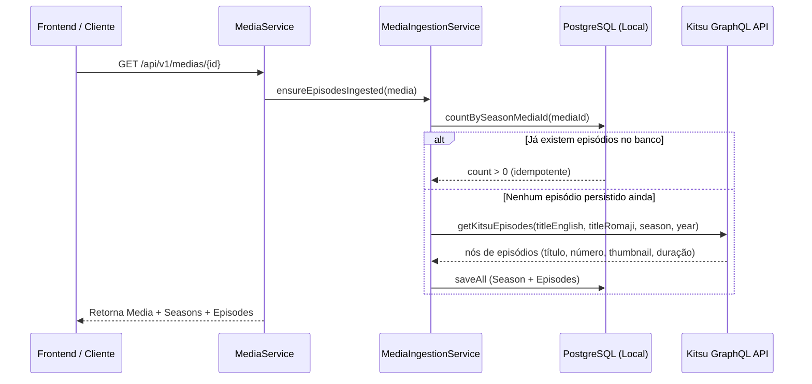

A busca e o gerenciamento dos episódios das obras no **RecapMe** funcionam por meio de uma arquitetura híbrida com **Ingestão Reativa (Lazy Ingestion)**, combinando metadados do **AniList** com a árvore detalhada de episódios do **Kitsu (GraphQL)**, persistindo tudo localmente no PostgreSQL.

---

### 1. Visão Geral do Fluxo

---

### 2. De onde vêm os dados dos episódios?

1. **AniList**: Usado para catálogo geral, metadados macro (título em Romaji/Inglês, banner, sinopse, ano de exibição, formato e estimativa do `totalEpisodes`).
2. **Kitsu GraphQL API** ([`KitsuClient`](file:///C:/Users/guima/OneDrive/Documentos/projects/recapme/backend/src/main/java/com/recapme/client/kitsu/KitsuClient.java)): É o provedor responsável por fornecer a **lista individual de episódios**, contendo:
   - Número do episódio (`number`)
   - Título oficial (`titles { canonical, translated, romanized, original }`)
   - Thumbnail oficial do episódio (`thumbnail { original { url } }`)
   - Duração (`length`)

---

### 3. Algoritmo de Matching e Busca no Kitsu

Como títulos de anime costumam divergir entre fontes (inglês vs japonês romanizado), o [`KitsuClient.getKitsuEpisodes`](file:///C:/Users/guima/OneDrive/Documentos/projects/recapme/backend/src/main/java/com/recapme/client/kitsu/KitsuClient.java#L135-L155) implementa uma estratégia tolerante a variações:

1. **Busca Dupla**: Faz a consulta GraphQL (`searchAnimeByTitle`) tanto pelo título em inglês quanto pelo título em romaji.
2. **Critérios de Correspondência**:
   - **Match Estrito**: Coincidência de ano (`startDate.year == seasonYear`) e período da temporada (`season`, ex: `SPRING`, `FALL`).
   - **Fallback por Ano**: Se a temporada não bater ou não existir, filtra pelo ano de estreia.
   - **Fallback Geral**: Se não encontrar por ano, pega o primeiro resultado com maior proximidade.
3. **Enriquecimento (`findAnimeById`)**: Se a listagem resumida do Kitsu não trouxer a lista completa de episódios no nó, o método [`enrichNodeIfEmpty`](file:///C:/Users/guima/OneDrive/Documentos/projects/recapme/backend/src/main/java/com/recapme/client/kitsu/KitsuClient.java#L195-L210) executa uma query pontual para recuperar até 100 nós de episódios.
4. **Priorização**: Compara os resultados encontrados para o título em inglês e romaji e seleciona o que tiver trazido a lista de episódios mais completa.

---

### 4. Ingestão e Persistência sob Demanda ([`MediaIngestionService`](file:///C:/Users/guima/OneDrive/Documentos/projects/recapme/backend/src/main/java/com/recapme/service/MediaIngestionService.java))

A busca e gravação dos episódios acontece via `ensureEpisodesIngested(media)`:

* **Idempotência**: Antes de qualquer requisição externa, o serviço executa `episodeRepository.countBySeasonMediaId(media.getId())`. Se os episódios já foram salvos anteriormente, **nenhuma requisição externa é feita**, servindo tudo direto do cache/PostgreSQL.
* **Criação da Temporada**: Cria ou associa a entidade [`Season`](file:///C:/Users/guima/OneDrive/Documentos/projects/recapme/backend/src/main/java/com/recapme/model/Season.java) correspondente (Temporada 1 por padrão).
* **Mapeamento dos Episódios**: Mapeia cada nó retornado pelo Kitsu para a entidade [`Episode`](file:///C:/Users/guima/OneDrive/Documentos/projects/recapme/backend/src/main/java/com/recapme/model/Episode.java):
  - **Título preferencial**: `canonical` $\rightarrow$ `translated` $\rightarrow$ `romanized` $\rightarrow$ `original` $\rightarrow$ `"Episódio X"`.
  - **Thumbnail**: URL da imagem original do Kitsu.
  - **Duração**: Duração em minutos (convertendo segundos caso venha $> 100$).
* **Fallback de Resiliência**: Se a API do Kitsu falhar ou a obra não possuir episódios catalogados no Kitsu, mas o AniList indicar uma quantidade total de episódios (`totalEpisodes > 0`), o backend gera automaticamente episódios placeholder (`Episódio 1`, `Episódio 2`...) para garantir que a obra não fique quebrada na interface nem nos filtros anti-spoiler.

---

### 5. Gatilhos de Ativação

A busca/ingestão de episódios é disparada nos seguintes momentos:

| Ação | Endpoint | O que acontece |
| :--- | :--- | :--- |
| **Acessar página de detalhes** | `GET /api/v1/medias/{id}` | Chama `ensureEpisodesIngested`, garantindo que ao abrir a tela de detalhes, a lista de episódios seja populada. |
| **Listar temporadas de uma obra** | `GET /api/v1/medias/{id}/seasons` | Garante a presença dos episódios antes de listar as temporadas. |
| **Listar episódios da temporada** | `GET /api/v1/seasons/{seasonId}/episodes` | Retorna a lista completa dos episódios ordenados por `episodeNumber ASC`. |
| **Consulta individual de episódio** | `GET /api/v1/episodes/{id}` | Retorna detalhes de um episódio específico por UUID. |
| **Ingestão Forçada** | `POST /api/v1/medias/ingest/{externalId}` | Faz a sincronização manual forçada puxando metadados e episódios. |

---

### 6. Como os episódios são utilizados no produto?

1. **Trava Anti-Spoiler (Frontend)**: O seletor de progresso (`SpoilerLockController`) utiliza a quantidade de episódios disponíveis para permitir que o usuário defina exatamente onde parou de assistir.
2. **Contexto Autorizado para a IA** ([`RecapService.getAuthorizedContext`](file:///C:/Users/guima/OneDrive/Documentos/projects/recapme/backend/src/main/java/com/recapme/service/RecapService.java#L115-L155)): Ao sintetizar resumos ou ao conversar com o assistente no Chat, o backend filtra os episódios no PostgreSQL com `episodeNumber <= userMaxEpisode` e `seasonNumber <= userMaxSeason`, alimentando o prompt do Gemini exclusivamente com os fatos dos episódios já vistos pelo usuário.
